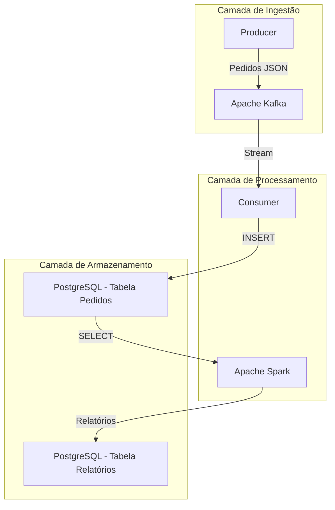

# Arquitetura do Sistema

## Visão Geral

O sistema implementa um pipeline de dados em tempo real para análise de vendas de restaurante, utilizando uma arquitetura moderna de streaming com Apache Kafka, processamento distribuído com Apache Spark e armazenamento em PostgreSQL.

## Diagrama de Arquitetura

## Componentes da Arquitetura

### 1. Camada de Ingestão
- **Producer**: Gera dados simulados de pedidos de restaurante
- **Apache Kafka**: Sistema de streaming distribuído (modo KRaft)

### 2. Camada de Processamento
- **Consumer**: Processa mensagens do Kafka e persiste no banco
- **Apache Spark**: Engine de processamento distribuído para analytics

### 3. Camada de Armazenamento
- **PostgreSQL**: Banco relacional para dados transacionais e analíticos

## Fluxo de Dados

1. **Ingestão**: Producer gera pedidos a cada 10 segundos
2. **Streaming**: Kafka distribui mensagens para consumers
3. **Persistência**: Consumer salva pedidos no PostgreSQL
4. **Analytics**: Spark processa dados a cada 1 minuto
5. **Relatórios**: Spark gera insights e salva relatórios

## Decisões Técnicas

### Kafka vs RabbitMQ
- **Escolhido**: Apache Kafka
- **Justificativa**: Melhor para streaming de alta throughput, durabilidade e replicação

### Spark vs Pandas
- **Escolhido**: Apache Spark
- **Justificativa**: Processamento distribuído, escalabilidade e integração nativa com big data

### PostgreSQL vs MongoDB
- **Escolhido**: PostgreSQL
- **Justificativa**: ACID compliance, queries complexas e maturidade para analytics

## Infraestrutura

- **Containerização**: Docker e Docker Compose
- **Orquestração**: Docker Compose para desenvolvimento
- **Rede**: Bridge network para comunicação entre containers
- **Volumes**: Persistência de dados PostgreSQL

## Escalabilidade

- **Kafka**: Suporte a múltiplas partições e brokers
- **Spark**: Processamento distribuído em cluster
- **PostgreSQL**: Read replicas e particionamento de tabelas